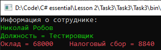

# Lesson2_task3
Условия задачки:
>Используя Visual Studio, создайте проект по шаблону Console Application.  
Требуется: 
Создать класс Employee.  
В теле класса создать пользовательский конструктор, который принимает два строковых аргумента, и инициализирует поля, соответствующие фамилии и имени сотрудника. 
Создать метод рассчитывающий оклад сотрудника (в зависимости от должности и стажа) и налоговый сбор.   
Написать программу, которая выводит на экран информацию о сотруднике (фамилия, имя, должность), оклад и налоговый сбор. 

От себя:
>Program.cs: 
>1. в поле EmployeePosition на 21 строке можно вставить значения "Тестировщик", "Программист", "Инженер"; 
>2. в поле EmployeeExperience на 22 строке можно вставить целочисленное значение от 0 и до 2147483647.

Подытог: вот такенный майндфак на выходе
>
